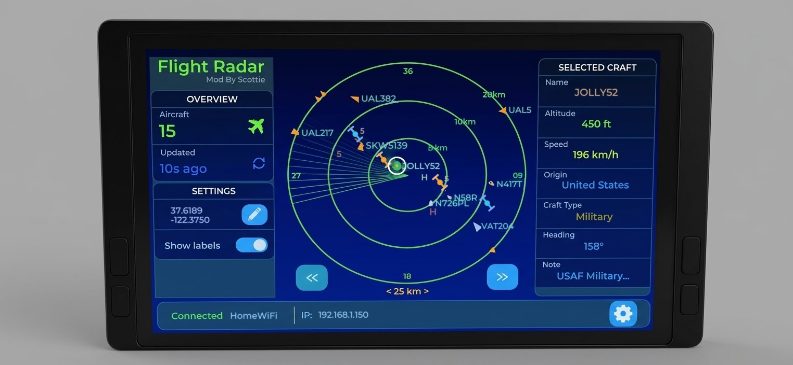
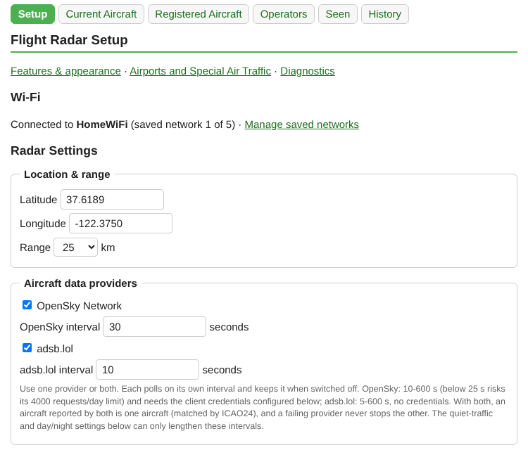
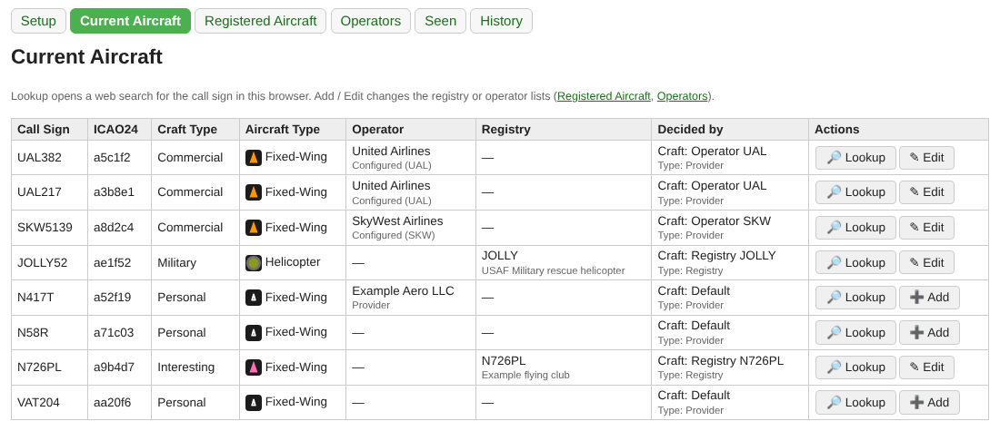
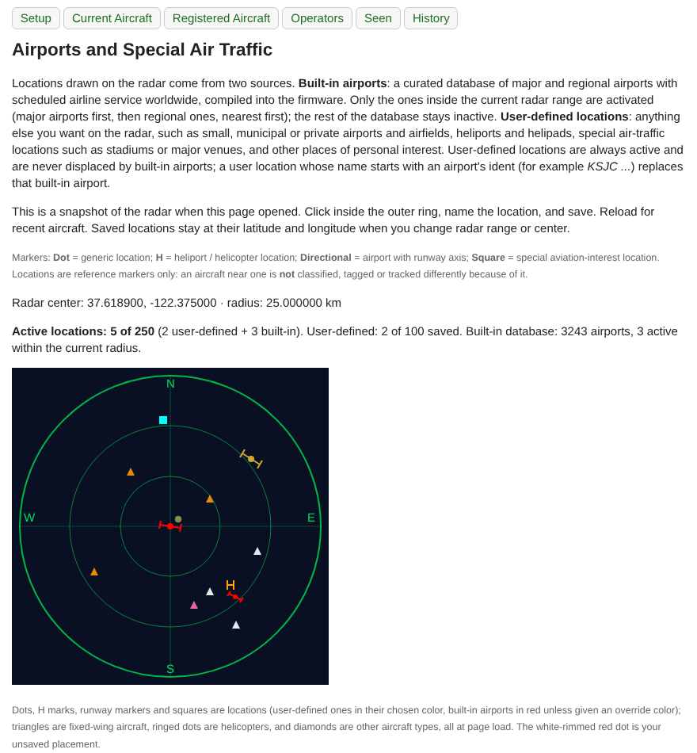
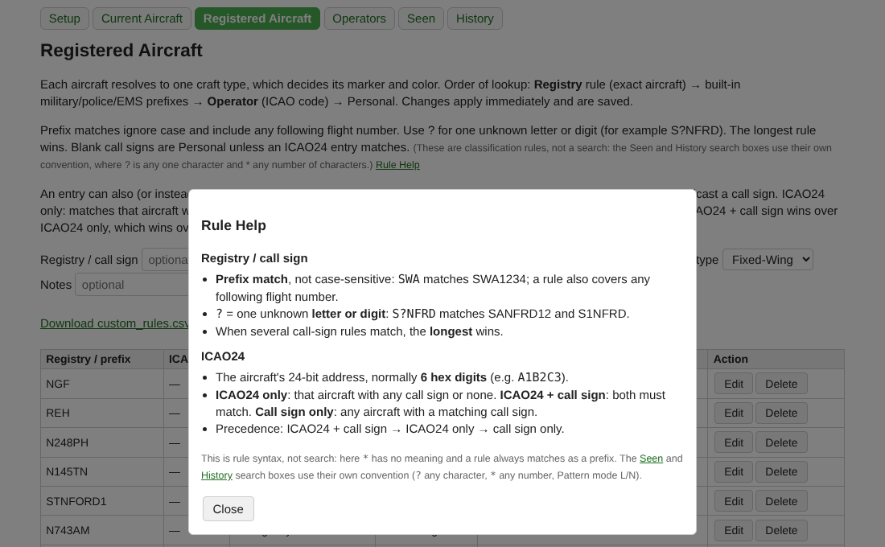
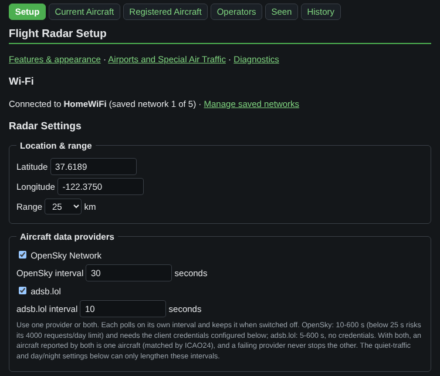
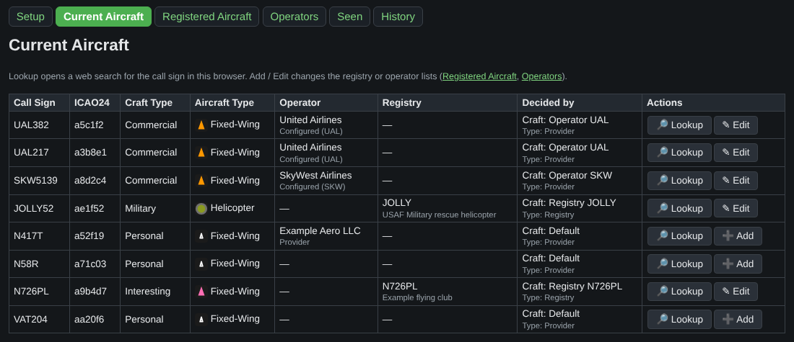
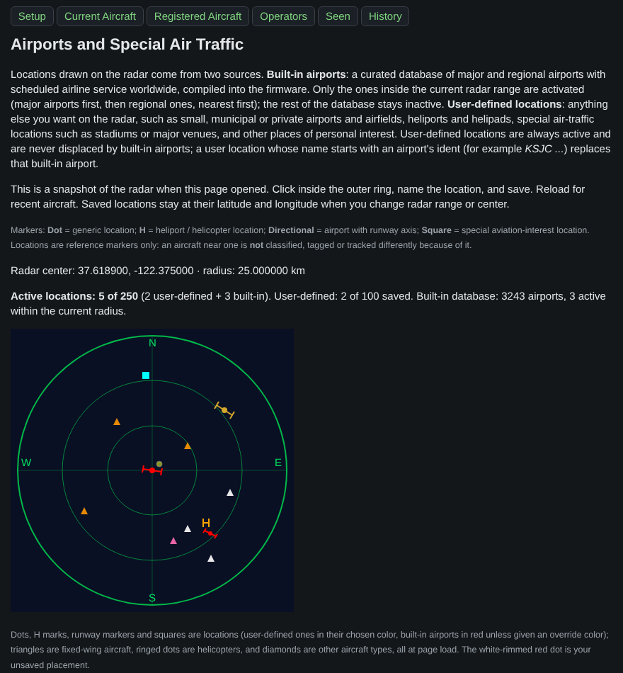
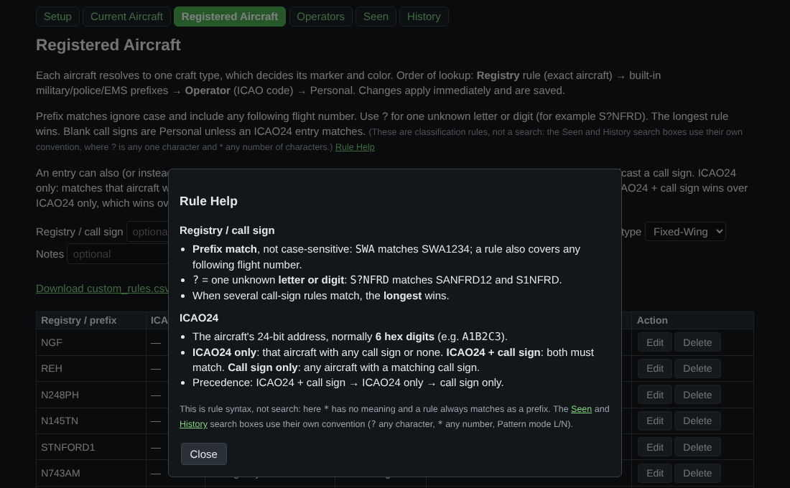

# ✈️ ESP32 Flight Radar — 7" Basic

**A real-time ADS-B flight radar built for the Elecrow 7" CrowPanel Basic HMI display.**

Live aircraft data from **OpenSky Network** or **adsb.lol**, rendered on an animated, sweep-style radar screen — fully configured through an on-device WebUI, no reflashing required.

*A heavily modified fork of the original Flight Radar project by Tech Talkies.*

---

## ✨ Key Features

### 🌐 Aircraft Data & Providers

- **Two data providers, usable one at a time or together (0.0.28):**
  - **OpenSky Network** (default) — the original data source, ~4000 requests/day, requires free OpenSky client credentials. Poll interval 10–600 s.
  - **adsb.lol** — a community-run ADSBExchange-compatible API. No account or credentials needed. Poll interval 5–600 s.
  - Each provider is switched on or off on its own and keeps its **own poll interval** (e.g. OpenSky 20 s, adsb.lol 5 s), remembered across reboots and while it is switched off. With both on, each polls on its own schedule — the faster one never waits for the slower one, and a failing, rate-limited or unreachable provider never stops the other.
  - **One aircraft per ICAO24:** an aircraft reported by both providers is one aircraft on the radar, in Seen and in History. Its position comes from the most recent report; information only one provider has (registration, owner/operator and type hint from adsb.lol, origin country from OpenSky) is kept rather than erased by the other provider's missing value. A provider whose last good data is older than two of its intervals stops contributing, so its aircraft do not freeze on screen.
  - The quiet-traffic slowdown and day/night polling schedule can only **lengthen** each provider's interval (effective interval = the longer of the provider's own interval and the schedule's), never make it poll faster, and never change the stored provider intervals.
- **Automatic Aircraft Type detection (adsb.lol only)** — adsb.lol's ADS-B category field gives a best-effort hint (helicopter, glider/UAV/lighter-than-air, ground vehicle), but it's only ever a *hint*: any aircraft you've manually classified in the registry keeps your manual choice, always. OpenSky's own category data is too unreliable to use for this and is never consulted.
- **Provider operator (adsb.lol, best effort)** — if adsb.lol includes an owner/operator name for an aircraft it is shown (labelled as coming from the provider) and kept in the Seen Aircraft history. This field is not part of adsb.lol's documented output, so it may be empty. OpenSky never provides one.
- **Robust to bad responses** — a malformed, truncated or unexpected response, or coordinates outside the valid range, never crashes the radar or wipes the aircraft already on screen; failed polls keep the last good picture.
- **Provider diagnostics mode** — Off / Normal / Verbose / Raw, toggled from the WebUI, no reflashing. Since 0.1.9 both providers report the same things: Normal shows each request with its number, elapsed time, HTTP status and size, any failure by kind (timeout, connect/TLS with the TLS error code, incomplete, response too big for its buffer, HTTP error) and, for adsb.lol, the same memory figures OpenSky prints before its secure connection; Verbose adds why each aircraft got the Aircraft Type it did (provider hint vs. your registry override) and where every record went (wrong format, no ID, no position, position out of range, on the ground, not looked at because the 200-aircraft list was full); Raw adds a size-capped, credential-redacted preview of the response and up to 8 example records per poll. The latest poll of each provider is also on `/diag` (*Provider last poll*) whatever the level. Diagnostics only observe: they never change which aircraft are shown.
- **Runtime capacity report** (`/diag`) — a lightweight, read-only page showing live memory health (internal, DMA-capable internal and PSRAM free / largest block / minimum-ever, plus failed memory allocations since boot), filesystem usage (Flash / filesystem: physical flash size, the 2.5 MB app partition with the installed firmware image's size and the room left, and SPIFFS used / free / total, each with used and free percentages), current vs. maximum-observed aircraft count, and how full your custom-rule/operator/airport/Seen-Aircraft storage is. No reflashing, no serial connection needed. See *Memory Stability & Diagnostics* below.
- Switching providers on or off is instant and doesn't require reconfiguring your radar location, range, or classification rules — they're shared across both. On the first boot of 0.0.28 the provider you were using stays the only one switched on and keeps your previous refresh interval.

### 🕑 Time Zone & Daylight Saving

- Pick your **time zone** by name (about 90 IANA zones such as `America/Los_Angeles`, `Europe/London`, `Australia/Sydney`, `Asia/Kolkata`), or use a **custom fixed UTC offset** for anywhere not listed.
- **Automatic daylight saving** switches PST/PDT (and the EU, Australian and New Zealand equivalents) on the correct dates by itself. It's a toggle, so regions that don't observe DST — or anyone who prefers standard time all year — can turn it off.
- Times are stored in UTC and converted only for display, so changing your zone never corrupts history. If the clock hasn't synchronized yet, the UI says "Not synchronized" instead of showing a made-up time.
- The day/night schedules use the same zone and DST setting. Existing installs keep working exactly as before: an older UTC-offset setting is carried over as a custom fixed offset.

### 📒 Current Aircraft & Seen Aircraft History

- **Current Aircraft** (`/current`) explains what you're looking at: call sign, ICAO24, craft type, Aircraft Type with its icon, operator (provider-supplied and configured operators are shown separately), your registry rule and note, and a **Decided by** column that says whether the classification and the Aircraft Type came from your registry, a built-in rule, the provider, or the default.
- **Seen Aircraft** (`/seen`) is a persistent log of every aircraft the radar has picked up, one row per ICAO24 and independent of which provider reported it: call sign, types, operator, first/last seen (in your time zone), seen count, and whether you've already configured it. Search, filter (all / configured / not configured), sort, and jump straight into the existing Add/Edit dialog. A **Search Help** link opens a popup over the page (Close returns you to the same page and search) with the rules and clickable examples. **Search convention (shared by Seen and History):** plain text matches anywhere (as before); `?` = exactly one character and `*` = any number of characters (a wildcard search matches the whole value, e.g. `UAL*`, `N12?`); tick **Pattern mode** to also use `L` = one letter and `N` = one digit (e.g. `LLLNNNN`); choose **In: Either / Call sign / Registration**. On Seen, *Registration* means a registration flown as the call sign or the matching Registered Aircraft rule; on History it also covers the registration reported by adsb.lol. `/registered` rules keep their own syntax (`?` = one letter or digit, always a prefix match); its **Rule Help** popup is a short reference next to the page's full explanation.
- **CSV export** for backup or spreadsheets (times in ISO-8601 UTC). There is no import, on purpose.
- **Flash-friendly by design:** sightings are kept in RAM and saved incrementally — only the aircraft that actually changed since the last save, not the whole history — at most every 10 minutes, and before a deliberate reboot, capped at **3,000 aircraft** with the least-recently-seen dropped first, and never written if flash space is tight. *Seen count* counts visits — an aircraft returning after 30 minutes or more counts again — rather than every poll.

### 🌐 WebUI & Display Management

- **Organized pages with one consistent look** — **Setup** (`/`), **Current Aircraft** (`/current`), **Registered Aircraft** (`/registered`: registry rules plus the Add/Edit dialog), **Operators** (`/operators`), **Seen** (`/seen`) and **History** (`/history`) share a navigation bar of plain links (works without JavaScript) and one stylesheet. Since 0.1.4 the navigation bar (with the device clock at its right end) **stays at the top while you scroll** (CSS only), and on **Setup** the *Flight Radar Setup* title and its section links (Features & appearance · Airports and Special Air Traffic · Diagnostics) stay visible under it; anchor jumps land below it. The old `/rules` address redirects to Registered Aircraft, including `?edit=` links. From **Seen**, *Add / Edit* opens that aircraft's registration directly. `/diag` and `/airports` (Airports and Special Air Traffic) are reachable by URL/link from Setup.

- **History page** (`/history`) — the persistent record on the TF card, kept distinct from the other views: *Current/Radar* is what is overhead now, *Seen* is the recent/hot list, *History* is what the card has stored, and *Diag* is system/storage diagnostics. The page opens on a **collapsed list of fingerprint groups** (fingerprint, operator, record count; 50 groups per page, unassigned first, registry-defined last), built from each group file's header only, so no aircraft record is read just to open the page. **Expanding** a group reads only that group, 50 records at a time, with *Showing 351–400 of 725* and Previous/Next. **Search**: an ICAO24 is found instantly through the index; a **call sign or registration** (e.g. `N12345`, `SWA7`, case-insensitive, partial) is found by a bounded scan of the group files (no extra index, nothing cached), up to 20 matches or 1,500 records per page with a *Continue search* link, each match linking to its group. A call sign/registration search is slower than an ICAO24 one: roughly 0.5–1.5 s per 725 records on the card (estimate from the measured 3–8 ms per file open; not yet timed on hardware). Each row shows ICAO24, call sign (with the registration under it when adsb.lol reports one; captured from 0.0.27 into the record's existing registration field), aircraft type / craft class, operator, first seen, last seen and seen count. A record that the index no longer considers current (the aircraft moved to a different operator/registry group) is shown, not hidden, with a **Superseded** badge; **Not indexed** and **Unverified** badges cover a missing index entry and an unreadable index. The page only reads the card: it never writes, deletes or repairs anything, never loads a group file into RAM (at most 8 records at a time) and releases the storage lock before sending each part of the page, so it cannot stall history writes. The operator is not stored in the record; it is derived from the group's fingerprint and the current operator list, so a group whose operator has since been removed shows as an unknown/removed operator. Linked from **Seen** and **/diag**.
- **History: call-sign history, click-to-search, sorting (0.1.4)**
  - **Call signs are no longer overwritten.** When an aircraft's call sign changes (e.g. SWA1234 → SWA2345), the next history save adds a **new record** instead of rewriting the old one; the old record stays as *Superseded* with its own first seen, last seen and Seen count, exactly like a record left behind by a group change. An unchanged call sign never creates duplicates, and at most one new record per aircraft is written per 10-minute save (if the call sign changes several times in between, the last one is kept). The new record starts its own first seen / Seen count; nothing is merged between records or groups. A change of group with the *same* call sign (an operator rule edited, or the brief boot-time "unassigned" moment before the operator table loads) keeps the previous behavior. **Limitation:** call signs that changed before 0.1.4 were overwritten on the card and cannot be recovered.
  - **Click an ICAO24** to see **every record of that aircraft in every group** (a scan of the card, *Continue* for more), followed by the call signs found **per fingerprint** — e.g. *Southwest: SWA1234 · SWA2345 · SWA3456* and separately *Delta: DAL1234*; a group never shows another group's call signs. **Click a call sign** for an exact call-sign search (whole value, not case-sensitive). The search box also has *ICAO24 (every record)*.
  - **Check these aircraft** (link under an expanded group page): one bounded read of the card that adds, on the first row of each aircraft on that page, the call signs it has **in this group** and a link *Additional history in other fingerprints (N)* when it has records elsewhere — only from stored records. It reads up to 4,000 records and says so if it stopped early.
  - **Order**: Default (fingerprint), **Most records first** or **Fewest records first** — by each group's record count (the number shown on the group row, not distinct aircraft or call signs), equal counts in fingerprint order, 50 groups per page. Sorting reads every group's header once (no records); if a group's count cannot be read the page says so instead of showing a wrong order. A search keeps the chosen order for its *All groups* link.
- **Optional features (Setup → Features & appearance)** — switch **Seen logging**, **Current Aircraft**, **Registered Aircraft matching** and **Registered Operators matching** on or off; they persist across reboots. Turning one off never deletes data and never affects tracking or the radar display: aircraft simply use the default classification where a registry/operator lookup is off, and Seen stops adding new records (existing history stays visible).
- **Dark mode** — optional, persistent, WebUI only (the radar screen is unchanged). Off by default.
- **Firmware build identifier** — put a one-line build name in `src/VERSION` (currently `0.1.9`); it is compiled in at build time and shown as **Firmware Build** at the top of `/diag`, so you can tell which firmware is really running. A missing or empty file stops the build.
- **Brightness control** — full LCD backlight adjustment from the WebUI, including a manual slider.
- **Screen orientation (0.1.2)** — Setup → Display → *Screen orientation*: **Normal** (default, also on devices that never saved the setting) or **Rotated 180°**, for a panel mounted upside down. The whole device screen turns (radar, labels, clock, status bar, every screen and dialog); positions, headings and all stored data are unchanged. It applies immediately without a restart and is kept across power cycles. Rotated 180° uses about 768 KB of extra PSRAM while it is active (a 768,000-byte frame plus a few hundred bytes of bookkeeping, freed again when you return to Normal) and copies each frame's changed areas, so it costs some CPU time per frame; its effect on the radar sweep has not been measured on hardware yet. If the memory is not available the screen stays Normal and the page says so.
- **Day/night scheduling** — separate poll-interval and brightness behavior for day vs. night, on a configurable local time window that follows your configured time zone and daylight saving setting.
- **Idle dimming** — automatically dims the backlight after a period with zero aircraft in range, restoring instantly when traffic reappears.
- **Low-traffic poll slowdown** — stretches the polling interval when few or no aircraft are nearby, to conserve API quota.
- **Built-in airports, selected by region** — the firmware carries a curated database of **3,243 airports worldwide**: 1,151 major airports (large airports with scheduled service) and 2,092 regional airports (medium airports with scheduled service and an IATA code), from the public-domain OurAirports data. Only the airports **inside the current radar range** are activated — e.g. around the default San Jose-area center, 1 at 25 km and 7 at 100 km — so the rest of the world never clutters the radar. They are drawn in red with a runway-axis marker where the runway is known (Dot otherwise), major airports slightly larger. Small, municipal and private airfields, helipads and other special places are not built in; add them yourself.
- **Ground aircraft visibility** (on `/airports`) — by default nothing changes: an aircraft is *on the ground* when the provider says so (OpenSky `on_ground`, adsb.lol `alt_baro: "ground"`) or when it is at or below **15 m (49 ft) and 8.5 m/s (16.5 kt)** (a value the provider does not send counts as 0), and on-ground aircraft are not shown or tracked. You can change both thresholds (ft / kt), ignore the provider's own on-ground flag, and choose what happens to on-ground aircraft at airports (within a radius, default 3 km, of a shown airport, heliport or your own Dot/Directional location): **Off** (default), **Count only** (a number next to the airport on the radar, and "*X of Y showing*" per airport on the page) or **Show aircraft** (drawn like any other aircraft). You can also **keep helicopters, INTERESTING, IMPORTANT and police/emergency aircraft visible while on the ground**, using the existing classification. Kept aircraft that the provider stops reporting stay at their last reported position for the **stale timeout** (default **5 minutes**, 1–60), measured from the provider's last report, then disappear; they are never kept permanently. An aircraft that takes off is shown normally at once, with the same identity. Shown on-ground aircraft are recorded in Seen and History like any other; stale ones never update Seen/History; hidden ones are not tracked, as before. Airborne aircraft always keep priority for the 200 aircraft slots. When all 200 slots are taken, on-ground aircraft at airports are still counted in *Y* (they just are not shown).
- **Built-in airport overrides** — the built-in database itself is read-only, but on `/airports` any active built-in airport can get your own **override**: **hide** it, move its **latitude/longitude**, or set its runway **rotation** in whole degrees (a rotation also gives an airport without database runway data the Directional marker). Only the fields you override change; everything else keeps the database value. **Reset to Default** deletes the override, and saving with every field at its default does the same. Each airport has one **Edit Override** / **Reset to Default** pair: in its row under *Built-in airports active now*, or, for an airport outside the current radar area, in *Stored overrides* (since 0.1.6 the stored list links to the active row instead of repeating the same two buttons). Overrides survive reboots, stay stored while the airport is outside the radar area and apply again when it comes back, and never use one of the 100 user-defined location slots (up to 100 overrides). A hidden airport stays in the active list but is not drawn; the section shows "*N of M showing*" (active airports actually drawn vs. active for the current area). You can also give a built-in airport its own **display color** (e.g. KNUQ in RGB 212,167,44) with the same color picker your own locations use; it stays a built-in airport for selection, counts and priority, and Reset to Default brings back the default red. A user location named after the airport still replaces it, as before. When a number looks short, the line says why, e.g. *0 of 0 showing (1 replaced by a manual entry)* when your own location named `KSJC ...` stands in for built-in KSJC, *0 of 1 showing (1 hidden by override)*, *moved outside the radius by a position override*, or *not active: 250-location limit reached*. Airports simply outside the radar area are never counted or mentioned.
- **Location capacity and priority** — up to **250 active locations**: all of your user-defined locations (up to 100 saved) plus the built-in airports selected for the current range in the remaining slots (at least 150). When more built-in airports are in range than fit, major airports come first, then regional ones, nearest first. Your own locations are never displaced, and a location whose name starts with an airport's ident (e.g. `KSJC My field`) replaces that built-in airport.
- **Airports and Special Air Traffic** (`/airports`) — user-defined locations drawn on the radar (up to 100 saved), each with **its own configurable color** and size and one of four marker types: **Dot** (generic location), **H** (heliport / helicopter location), **Directional** (airport with runway axis; set by its *Primary runway / direction*: a runway number 01–36 with optional L/C/R, which is **magnetic** like the runway sign, or since 0.1.3 a **direction 0–360° true written with 3 digits**, 000–360, where 000 and 360 are the same direction — the same meaning as a built-in airport's Rotation override; other values are rejected in Directional mode) or **Square** (special aviation-interest location such as a stadium or major venue — e.g. Levi's Stadium). These are **contextual markers only**: an aircraft flying near one is never classified, tagged or tracked differently because of it (normal traffic crosses these places all the time). Event-aware behavior is possible future work and is not implemented. A fresh install starts with about 50 real Northern California airports (plus a few major West Coast/Southwest hubs) already on the map as a starting point — edit, remove, or add your own from `/airports` at any time; an existing install's list is never touched by this. Directional mode draws a simplified runway-axis marker (a short line through the airport, capped at each end, with a small center dot) along the primary runway's physical axis — enter a runway designator like `09`, `27L` or `18C` and it figures out the orientation, correctly treating reciprocal ends (09/27, 18/36, ...) as the same physical strip. If the runway designator is left blank or doesn't parse, the airport just shows as a plain dot, same as before — it never guesses. The `/airports` page shows exactly what the radar will draw, the live active/user/built-in counts, and the list of built-in airports currently active. Locations outside the current range stay saved and reappear when the range or center includes them.
- **Off-screen aircraft indicators** — a known aircraft that's flown beyond your configured radar range still gets a small marker on the outer ring, positioned by its real geographic direction from your radar (never by which way it's pointed), in its usual classification color. Moves and rescales correctly with whatever range you have set, from the smallest to the largest supported value.

### 🎨 Aircraft Classification & Visuals

- **Runway-style compass** — clean outer ring with compact 2-digit aviation headings (`36`, `09`, `18`, `27`).
- **"Craft Type" classification** — a fully custom, user-editable classification system covering **ten** categories, independent of whichever data provider is active:

  | Type | Color | Type | Color |
  |---|---|---|---|
  | Personal *(default/unknown)* | ⚪ White | Military | 🫒 Olive |
  | Private | ⬜ Grey | Police | 🔵 Blue |
  | Business | 🩵 Powder Blue | Emergency Services | 🔴 Red |
  | Commercial | 🟠 Orange | Interesting *(personal watchlist)* | 🩷 Pink |
  | Cargo | 🟣 Purple | Important *(VIP / high-priority)* | 🟡 Yellow fill, 🔴 red border |

- **Aircraft Type (Fixed-Wing / Helicopter / Other)** — independent of classification color. Any aircraft can be marked as a **Helicopter** (solid circle) or **Other** (diamond, for uncommon aircraft — airships, autogyros, and the like) instead of the usual triangle, either automatically (adsb.lol hint) or manually via a registry rule. A manual registry rule always wins over the automatic hint, even if that rule just confirms Fixed-Wing.
- **Directional indicators** — Helicopter and Other markers both show heading: a short line through the helicopter's ring, and a small gray/black forward tip on the Other diamond. Both use the radar's usual north-up convention and simply don't draw if heading is unavailable.
- **Marker hierarchy:**
  - **Personal** aircraft (the default/fallback): small **hollow outline triangle**.
  - **Important:** solid filled triangle with a **red outline** — yellow fill, red border, for maximum visibility.
  - **Every other classification:** solid filled triangle, colored per the table above.
  - **Any classification, when marked as a Helicopter:** solid circle (≈18px) with a ring in that classification's color, plus a heading line in the same color — e.g. a Police helicopter is a blue-ringed circle, an Emergency helicopter is a red one. An Important helicopter's ring (and heading line) is red (matching its border), while every other classification's ring is a fixed gray.
  - **Any classification, when marked as Other:** a classification-colored **diamond** with a fixed gray/black forward tip showing heading — e.g. a pink diamond for Interesting, an olive diamond for Military. Important's diamond gets its usual red outline in addition to the yellow fill; the tip stays gray/black regardless of classification.

### 🏷️ Custom Callsigns, Registrations & Operators

- **Built-in defaults** — a maintained table of common airline ICAO codes, military/police/emergency callsign prefixes, shipped out of the box.
- **VIP / special-mission prefix rules** — seeded defaults (`SAM`, `SPAR`, `EXEC`, `PAT` → Important) for watching VIP and government-transport call signs, fully editable/removable like any other rule. These are ordinary prefix rules, not a hard-coded list — a specific registration you configure separately (e.g. `SAM123`) always takes precedence over the broader pattern.
- **Match by ICAO24** — a registration entry can name the aircraft's **ICAO24** hex address instead of, or as well as, a call sign; the call sign stays optional. ICAO24 only matches that aircraft whatever it broadcasts as a call sign (including nothing — useful for aircraft that never send one); ICAO24 + call sign requires both. When several entries fit, ICAO24 + call sign beats ICAO24 only, which beats a call-sign rule. The ICAO24 only identifies the aircraft — its classification always comes from what you configured. Available on **Registered Aircraft** and in the Current Aircraft / Seen *Add / Edit* dialog.
- **Notes** — an optional, free-text field on any registration entry (e.g. `HL8299 → Interesting → "South Korea, LG Electronics"`), persisted alongside its classification, editable from the WebUI and shown as a tooltip on the Current Aircraft table.
- **Fully editable via WebUI** — add, edit, delete, or restore-to-default any operator code or aircraft registration rule directly from the browser, no hard caps on how many you keep (backed by plain CSV files on the device's flash, not a fixed-size table).
- **Bulk backup/restore** — export and re-import your custom classification rules as CSV.
- **One-click Lookup + Add/Edit** — the Current Aircraft table lets you look up any aircraft currently in range (the web search always says *aircraft* and uses the ICAO24 and call sign, e.g. `aircraft ICAO24 a1b2c3 callsign N12345`, so a call sign that looks like a part number still finds the aircraft) and configure its classification/type in a couple of clicks, prefilled with what's already known about it.

### 📶 Wi-Fi, Selection & Storage Controls

- **Saved Wi-Fi networks** (`/wifi`) — up to 5 profiles in one store: add, edit, delete, and connect on demand. Passwords are never shown or logged.
- **Auto-select closest aircraft** — optional; the Selected Craft display follows the closest aircraft and updates immediately.
- **Radar north: True or Magnetic (0.0.32)** — aircraft report their track relative to **true** (geographic) north, while runway numbers (e.g. SJC 12/30) are **magnetic** headings. The radar now reconciles the two using the local **magnetic variation**, computed on the device from the World Magnetic Model (WMM2025; no internet needed). Setup → *Features & appearance* → *Radar north*:
  - **AUTO** (default): magnetic north is up whenever the model gives a reliable value for your radar location (it falls back to true north only if it cannot, which `/diag` reports).
  - **MAGNETIC**: magnetic north is up, so runways line up with their numbers and aircraft headings match what pilots and ATC use.
  - **TRUE**: geographic north is up (the look before 0.0.32), with runways still drawn at their real orientation.
  The small ▲M / ▲T in the upper-left corner of the radar view (0.1.1; previously next to "36") shows which one is in effect, and the Selected Craft heading carries the same letter (e.g. `306°M`). The variation is saved in SPIFFS, so it is ready right after a reboot; it is recomputed when you change the radar location and refreshed yearly during a quiet (no-aircraft) period. A built-in airport rotation override (on `/airports`) is a true (geographic) angle.
- **Clock and status (0.0.32)** — the device shows the current local time (your time zone and DST setting) in the centre of the bottom bar, with the firmware version and uptime in small text beside the settings button. Setup → *Show clock on the device screen* (on by default; since 0.1.6 a separate switch) and *Clock format*: 12-hour (default) or 24-hour. Hiding the clock only removes the time from the bottom bar, at once and without a restart; time keeping, time zone and DST continue, the chosen format is kept for when you show it again, and the WebUI clock (which uses the same format) is unaffected. A device that had the clock set to *Off* before 0.1.6 keeps it hidden. Every WebUI page shows the device's local time in the navigation bar, and `/diag` lists it under Identity. Since 0.1.3 the nav-bar time stays current while the page is open: the page carries the device's time, UTC offset and next daylight-saving change, and a tiny script advances it in the browser on each minute boundary (never the browser's own clock or time zone, and it never contacts the device again; a page left open for more than 8 days, or across two offset changes, asks to be reloaded). If the device clock is not synced yet it still shows "time not synced".
- **Accent colors (0.0.32)** — two independent settings, both green (#4CAF50) by default: **Radar accent color** (rings, sweep, compass and range labels, call signs) and **WebUI accent color** (navigation highlight and heading lines). Aircraft classification colors and your location marker colors are not affected.
- **Selected Craft panel (0.0.30)** — the Craft Type value is shown in the aircraft's radar classification color (e.g. Commercial orange, Police blue, Military olive, Cargo purple, Important yellow); a row under Heading shows the **Note** of the matching Registered Aircraft entry, or otherwise the **Airline** (your configured operator from the call sign, else the operator name adsb.lol supplies), and is hidden when neither is known; an optional **altitude trend arrow** (climbing / descending, from the climb rate the provider reports: shown after two consecutive reports of at least 400 ft/min, cleared below 200 ft/min, so it does not flicker); and the **Speed** row can be switched off (a speed the provider did not send shows ---, not 0). Both options are on the Setup page under *Features & appearance* and default to On.
- **Hot Seen eviction policy** (Setup) — when the 3,000-aircraft Seen table is full, choose what is dropped first: unregistered aircraft (default), oldest first (FIFO), or registered aircraft.
- **Flush now** (`/diag` → Storage / History) — writes pending Seen and History data immediately and reports the result.

### ⚙️ Telemetry, Filtering & Stability

- **Ground traffic filter** — hides grounded aircraft (on-ground flag, or near-zero altitude *and* speed as a fallback for feeders that omit the flag), applied identically regardless of which provider is active.
- **API rate-limit guard** — detects rate-limit responses from each provider, shows an on-screen warning banner naming the provider concerned, and backs off automatically before retrying (an hour for OpenSky's documented quota, a shorter conservative pause for adsb.lol, which publishes no fixed quota).
- **Toggleable serial debug logging** — inspect raw OpenSky fields, or the new multi-level provider diagnostics (Normal/Verbose/Raw, covering both providers), over Serial without reflashing.

### 🧠 Memory Stability & Diagnostics

- **Why it matters:** the ESP32-S3 has megabytes of PSRAM, but Wi-Fi and TLS need a specific, scarce kind of memory — *internal, DMA-capable* RAM. An earlier version failed intermittently on OpenSky HTTPS requests because Wi-Fi could not get a ~1.6 KB internal DMA buffer, even though plenty of total memory was free.
- **What was changed (implemented):** CPU-only working buffers no longer take that scarce memory. The WebUI's upload, main-page and `/seen` page buffers now live in PSRAM; the OpenSky HTTP client's own buffers and its authorization header are deliberately placed in PSRAM; one-time crypto/network initialization is done at a controlled point during boot; and LVGL's 64 KB graphics memory pool is provided from PSRAM. Internal DMA-capable RAM is intentionally kept free for Wi-Fi, TLS and hardware (display, SD card).
- **Tested:** after the WebUI-buffer and HTTP-client changes, the device has been observed completing repeated OpenSky HTTPS requests (HTTP 200) with zero failed allocations, around 72 KB of DMA-capable memory free and a ~31.7 KB largest DMA-capable block. The LVGL pool move is built and verified at link time (+64 KB internal DMA-capable heap) but still awaits a long on-device soak.
- **TF diagnostics and device controls on `/diag`:** a stage-by-stage view of the TF/microSD pipeline (mount, filesystem, history folder, index, last error with codes), a non-destructive **TF self-test** (writes, reads back and deletes one scratch file; never touches history data), **Unmount TF / Reinitialize TF** (real teardown and re-init of the card driver, showing which step succeeds or fails), and **Reboot Device** (confirmation dialog; a normal restart that keeps all settings, Seen data, registered aircraft/operators/rules and the card contents).
- **Min-ever timestamps and operation counters:** `/diag` now shows when each heap/stack minimum was first seen and, for the provider refresh, OpenSky token, Seen flush and TF flush, run/failure/skip counts, durations and the last failure, with an ATTENTION flag after repeated failures. From 0.0.31 each of these operations also shows its **last run as start → finish with the duration** (e.g. `2026-10-07 09:42:31 → 09:42:33 PDT (1.982 s)`), its result, its worst run and, only after a failure, the time of the last success — in your configured time zone, right next to that operation (the Seen flush in the Seen persistence table, the History flush in the TF history table). Before the clock has synced it shows time since boot (`T+812s (clock not synced)`). Since 0.1.6 the table also has **OpenSky fetch** and **adsb.lol fetch** rows: the same aircraft-list measurements as *Provider refresh*, split by provider, each marked *enabled* or *disabled* (and with any rate-limit wait), so an empty row reads as "not used", not as a fault; *Provider refresh* stays the combined row and the OAuth token row is OpenSky-only (adsb.lol needs no token). HTTP status, response size and parse counts are not stored for either provider (serial log only, with Provider diagnostics on). **Failed heap allocations** now shows when the last one happened (`74; last at 2026-10-08 22:20:34 PDT`), `0 (none since boot)` when there were none, or *time unavailable* if it could not be read; the time is taken safely inside the allocator hook as time since boot and converted when the page is drawn. Detailed event lines on the serial log appear only when Advanced or Expert diagnostics is on.
- **Diagnostics export (0.1.7; console-log status added in 0.1.8):** `/diag` has two download links, **plain text** (`/diag?fmt=txt`) and **JSON** (`/diag?fmt=json`). Both are made from the same rows as the page itself, so the numbers cannot disagree. The JSON also has a typed `metrics` object (schema 1: firmware, uptime, clock, internal/DMA/PSRAM heap, minimums with when they were first seen, stack minimums, failed allocations, operations, providers, aircraft, TF/History/Seen storage, console-log capture). A value that is not available is `null` with a `..._null_reason` next to it, never a made-up 0. The text file ends with `=== END OF REPORT (complete, N table rows) ===` and the JSON with `"complete":true`, so a cut-off download is easy to spot. File names look like `fr7-diag_0.1.7_20261009-142233.txt` (`_T812s` before the clock is set). Exporting resets nothing.
- **Provider last poll (0.1.9):** `/diag` (Radar / Provider group) shows OpenSky and adsb.lol side by side: enabled, request number and time with duration, the request URL (position shortened to one decimal), outcome (ok, ok with no aircraft, ok but partial because the list was full, invalid JSON, unexpected document, HTTP error, rate limited, transport failure, response truncated, request in progress), HTTP status, bytes kept / received / Content-Length, transport failure with its codes, the per-stage record counts, and the last successful and last failed poll. One provider failing never hides behind the other one's success. The JSON export has the same values per provider under `providers[].last_poll` (null with a reason before the first request). An adsb.lol response that does not fit its 32 KB buffer is now treated as a failed request instead of an "HTTP 200" that only fails later as bad JSON.
- **Save console logs to the TF card (0.1.8, off by default):** under *Storage / History* → *Console logs on TF card* on `/diag`. When switched on (takes effect after a reboot), a copy of the serial console's log lines is written to `FR7LOG/L<boot><part>.LOG` on the TF card (e.g. `L0001201.LOG` = boot 12, part 1). Serial output itself is unchanged. Each file starts with a header (firmware, boot, reset reason, local time), has a time marker about every 5 minutes, marks lost lines (`=== DROPPED ... ===`) and ends with a clean-end marker on a deliberate reboot; a log cut off by a crash or power loss is marked *interrupted* at the next boot. Limits: 1 MiB per file, 32 MiB and 64 files in total (the oldest log files are deleted first), and writing pauses while the card has less than 64 MiB free. Only these log files are ever deleted: never Seen or History data, never the file being written or downloaded. Passwords, tokens, authorization headers, Wi-Fi network names/BSSIDs and the decimals of coordinates are masked in the saved copy. **Not captured:** the bootloader and early boot before logging starts, crash/panic output, `esp_rom_printf` lines (including Expert Debug's FAILED_ALLOC lines; a summary line is written instead) and LVGL's own warnings. Card writes are batched (about every 5 seconds, sooner when the buffer is half full) and are postponed while the largest free internal DMA-capable memory block is below 4 KB, because every SD-card block write briefly needs such a buffer; the lines wait in the buffer meanwhile, and `/diag` shows how often and how long writing was postponed. A line logged by a task while it holds the TF card lock (e.g. a History write error message) is printed on the serial console but not saved, and counted. Cost while on: about 40 KB of PSRAM plus one 4 KB internal-RAM task stack (about 4.4 KB of internal RAM with the task itself); while off nothing is allocated and no task runs.
- **Who can reach the log files:** the file list, downloads, deletion and the on/off setting are offered only to a browser on **your own Wi-Fi network**. The device always runs the open *Flight-Radar-Setup* hotspot (no password), so a browser connected through it sees only the status counters and gets *403 Forbidden* for the rest. The WebUI has no login: anyone who can reach the device on your network can download or delete the logs, and (as for every WebUI form) a web page you visit could submit a delete request to the device; the confirmation tick-box is the only guard.
- **Diagnostics:** the normal `/diag` page shows DMA-specific memory health and a failed-allocation counter (with the size, type and task of the last failure) — no special mode needed. Optional **Advanced Diagnostics** and **Expert Debug** modes (toggled on `/diag`, applied after a reboot, off by default) add detailed heap tracing for troubleshooting; normal operation never needs them.

### 🗄️ Data Storage (HOT / WARM / COLD)

**How the layers relate (0.1.5 audit):** Seen (RAM + SPIFFS) and the TF-card history are fed **side by side** from every poll; nothing is moved from Seen to the card. When the 3,000-aircraft Seen list is full it replaces its least-recently-seen entry (Seen's own copy only); that aircraft's TF history was written independently, normally within about 10 minutes of first sighting. Since 0.1.5 the History writer never discards unsaved history to make room: if the card cannot take a write, the waiting records stay in RAM for the next save and a new aircraft is simply tracked by Seen until there is room (`/diag` → TF history → *History pending protection*). Full audit, remaining power-loss risks and recommendations: `docs/TF_HISTORY_INTEGRITY_AUDIT.md`.

| Tier | Where | What |
|---|---|---|
| **HOT** | RAM / PSRAM | Current aircraft, the Seen Aircraft table, the History Manager's per-aircraft working copies (with change tracking), and the Universal Value table (a compact, stable ID for each operator, in PSRAM) |
| **WARM** | Internal flash (SPIFFS) | Seen Aircraft history, saved **incrementally** (only changed aircraft) at most every 10 minutes; settings in NVS; your rule/operator CSV files |
| **COLD** | TF / microSD card | *(active; still being verified)* Long-term per-aircraft history, grouped into files by operator with an on-card index and per-record checksums |

**TF/microSD status: working, still being verified.** The long-term history code (History Manager, Universal Value table, on-card index and history files) is switched on; the card is mounted at boot and history is written to it. On the development unit the earlier "nothing is written" symptom was caused by a **defective, read-only 16 GB card**, not by the firmware; with a working 64 GB FAT32 card the history folder and index are created, records are written (41 created in the first run, 0 errors) and the index reloads correctly after a reboot. `/diag` now shows each TF stage with its error codes and has a non-destructive TF self-test, so a bad card shows up immediately ("card mounts but cannot be written"). The history index holds 32,768 aircraft (it was 4,096): on the first boot of build 0.0.19 the old index is read-only left in place and a new one is built beside it from the history files, checked, and only then switched on (a few seconds, once; if power fails meanwhile the next boot simply repeats it, and no history file is ever changed). A warning shows at 70% full, and at 90% new aircraft stop being added to History (they stay in the Seen list) instead of being written without an index entry. Still to be confirmed over a longer run: lookups finding existing history after a reboot, the 10-minute flush cycle, the real migration time on the device and multi-day behaviour. Several planned pieces are not built yet: moving existing Seen history onto the card, a ~12-hour "hot" Seen cache, running card work in its own background task, and file compaction.

The card is optional either way: without one, or if it fails, the radar, WebUI and Seen history run normally from RAM and internal flash.

**SPIFFS capacity (measured 0.1.2 baseline, planning only).** The 4 MB flash holds the 2,621,440-byte factory app partition and a 1,507,328-byte SPIFFS partition, of which SPIFFS can use **1,378,241 bytes** (what `/diag` reports as "total"; the rest is SPIFFS's own lookup pages and two reserved blocks). No SPIFFS image is built or flashed: every file is created by the firmware at runtime. A development device with Seen history in daily use measured **313,750 bytes used (22.8%)**. With Seen full (3,000 aircraft) and the default lists the files need about **258 KB**; with every list at its firmware maximum (5,000 registry rules and 1,000 operators with all fields at full length, plus a full Seen file) about **1,020 KB (74%)**. Re-run the measurement any time with `python3 tools/spiffs_audit.py` (see *Building & Testing*). The partition layout is unchanged; the reduced-SPIFFS scenarios in `PROJECT_STATE_COMPACT.md` are calculations for a future decision, not a recommendation.

---

## 📸 Screenshots

All screenshots use a fictional example setup (radar centre 37.6189, -122.3750, network "HomeWiFi", 192.168.1.150, example call signs and registrations); no real installation data is shown.

### Device UI

*The 7" radar screen: live aircraft with labels, built-in airports (runway-axis markers), heliports, the overview / settings panels and the Selected Craft panel for the highlighted helicopter. Photo of a real device; location, network and aircraft identifiers replaced with example values.*

### WebUI

The WebUI images below were rendered from the 0.0.30 WebUI handler code with example data (not captured from a live device).

| Setup: location and aircraft data providers | Current Aircraft |
|---|---|
|  |  |
| *Location, range and the OpenSky / adsb.lol provider intervals.* | *Each aircraft with its craft type, operator, registry match and what decided it.* |

| Airports and Special Air Traffic | Registered Aircraft with Rule Help |
|---|---|
|  |  |
| *Radar snapshot of active built-in airports and user-defined locations; click to add a location.* | *Registry / call-sign / ICAO24 rules and the built-in rule syntax help.* |

#### WebUI in Dark Mode

The same four pages with **Dark mode (WebUI only)** enabled under Setup → Features & appearance; rendered the same way. The device screen has no dark mode setting, so it has no dark counterpart.

| Setup: location and aircraft data providers | Current Aircraft |
|---|---|
|  |  |

| Airports and Special Air Traffic | Registered Aircraft with Rule Help |
|---|---|
|  |  |

---

## 🛠️ Hardware & Software Stack

| | |
|---|---|
| **Hardware** | Elecrow CrowPanel Basic 7" — ESP32-S3, 800×480 RGB TFT |
| **Framework** | ESP-IDF v6.1 / FreeRTOS |
| **Graphics** | LVGL 8.4, UI laid out in SquareLine Studio, driven via the ESP32-S3's native RGB LCD peripheral (`esp_lcd`) |
| **Data sources** | OpenSky Network REST API (default), adsb.lol REST API |

> **Note on touch:** this board has a GT911 capacitive touch controller, but it does not respond over I2C on this particular unit — a known, community-documented hardware-level issue with this SKU rather than a bug in this firmware. All configuration is done through the WebUI instead.

---

## 🚀 Configuration & Usage

1. **Wi-Fi & WebUI setup** — on first boot, connect to the device's fallback access point and configure your home Wi-Fi. Once connected, access the WebUI at the device's IP address.
2. **Choose your data providers** — on the Radar Settings page tick **OpenSky Network** (upload your free OpenSky client credentials through the WebUI), **adsb.lol** (no credentials needed), or both, and set each one's poll interval.
3. **Radar & classification setup** — set your center latitude/longitude and range, time zone and daylight saving, day/night and idle-dim schedules, and your custom aircraft/operator classification rules. These apply the same way no matter which provider you've picked.
4. **Watch and learn** — the **Current Aircraft** table shows what's overhead and why it's classified the way it is; **Seen Aircraft** (`/seen`) builds a history you can search, export, and turn into registry/operator rules.

---

## 🗺️ Roadmap

- [ ] Verify TF/microSD long-term history over a longer run: lookup hits after reboot, flush cycle, soak (writes and reboot persistence already confirmed on a working card)
- [ ] History CSV export.
- [ ] Revisit touchscreen support if a working fix for this board's GT911 issue ever surfaces

---

## 🧪 Building & Testing

- **Firmware version:** edit `src/VERSION` before each build you intend to flash (single line; letters, digits, `.`, `-`, `_`, `+`). CMake re-runs automatically when it changes.
- **Build:** ESP-IDF v6.1, target ESP32-S3, C (gnu23), e.g. VS Code with the ESP-IDF extension, then `idf.py build`. After pulling this version do a **clean rebuild** (widely-included headers changed).
- **Host tests:** `sh host_tests/run.sh` (needs gcc and python3) runs the off-device suite under ASan/UBSan (and ThreadSanitizer for the concurrency tests) with ESP-IDF stubbed. It covers the History index, `/history`, `/diag`, Wi-Fi profiles, auto-select, Seen eviction policies, manual flush, diagnostics telemetry and the shared WebUI navigation. It does **not** replace `idf.py build` or testing on the device.
- **Screen rotation test:** `host_tests/run.sh` also builds the real LVGL 8.4 library for the host (cached after the first run) and drives the shipped rotation code through repeated Normal ↔ 180° switches, checking every pixel the panel would show.
- **SPIFFS capacity audit:** `. $IDF_PATH/export.sh` then `python3 tools/spiffs_audit.py [--measured-used <bytes from /diag>]` from the repository root. It is read-only: it reads `partitions.csv`, `sdkconfig`, the firmware sources and the last build, and prints every SPIFFS file the firmware can create (raw bytes, SPIFFS pages, bytes used), the usable capacity, the app headroom and the reduced-SPIFFS planning scenarios. It never changes the partition table or flashes anything.
- **Diagnostics build option:** `menuconfig` → *Flight Radar diagnostics* → `FR_ALLOC_TRACE` compiles in an allocation tracer used only for deep memory troubleshooting (default off in Kconfig).
- **Developer notes:** `PROJECT_STATE_COMPACT.md` is the compact technical project-state summary, including the memory design rules that should not be undone.

---

## ⚠️ Current Status & Limitations

- **Verification status:**
  - *Implemented and built:* everything described above builds successfully with ESP-IDF v6.1 (`idf.py build`).
  - *Tested on hardware:* OpenSky login and repeated aircraft HTTPS requests, the WebUI, `/diag` memory reporting, incremental Seen Aircraft saving (with measured timings), TF card mounting, history writes and index reload after reboot (64 GB card).
  - *Version 0.0.20 changes* (Wi-Fi profiles, auto-select, eviction policies, manual flush, telemetry, WebUI polish) have been host-tested only; they have **not** been built with ESP-IDF or run on hardware yet.
  - *Version 0.0.23 changes* (Airports and Special Air Traffic marker types, Registered Aircraft ICAO24 matching) *0.0.24 changes* (built-in airport database, regional selection, 250 active locations) *0.0.25 changes* (built-in airport overrides, showing count), *0.0.26 changes* (`/history` fingerprint groups and call sign/registration search, ground aircraft visibility and retention), *0.0.27 changes* (built-in count explanation, shared search convention, registration capture, airport counts with a full list) *0.0.30 changes* (Selected Craft classification color, Note / Airline row, altitude trend arrow, optional Speed row), *0.0.31 changes* (display flicker fix during Seen saves, last-run times on `/diag`), *0.0.32 changes* (true/magnetic radar north with on-device magnetic variation, device and WebUI clock, independent accent colors, fix for saving more user-defined locations), *0.0.33 fix* (0.0.32 restarted in a loop at startup: the new magnetic-variation code opened a file while holding a lock where ESP-IDF forbids that; fixed, with a test that guards against it), *0.0.29 fixes* (settings-saved page no longer cut off, visibility-settings lock created at startup, app partition usage on `/diag`) and *0.0.28 changes* (OpenSky and adsb.lol together with independent intervals, ICAO24 reconciliation, built-in airport color override, aircraft-context Lookup, Search Help / Rule Help popups) are host-tested and build with ESP-IDF v6.1 (`idf.py build`); they have **not** been run on hardware yet.
  - *Version 0.1.9 (equal diagnostics for both providers: request/failure detail, adsb.lol pre-TLS memory line, per-stage record counts, bounded record samples, *Provider last poll* on `/diag` and in the JSON export; truncated adsb.lol responses treated as failures):* built with ESP-IDF v6.1 and host-tested (the real adsb.lol request path against a scripted HTTP client, the real parsers of both providers, the real recording and `/diag` rendering); **not yet tested on the device or against the live providers.**
  - *Version 0.1.8 (optional console-log saving to the TF card, with status, list, download, delete and the setting on `/diag`):* built with ESP-IDF v6.1 and host-tested (the real capture writer against a real directory: rotation, retention, free-space floor, failing writes, DMA-memory deferral; the log hook's context and lock rules; the writer running alongside real History writes and /history browsing under thread sanitizer; the interface check); **not yet tested on the device**: card removal, power loss, a real reboot sequence, the real DMA-memory behaviour of card writes and a long run with capture on have not been exercised.
  - *Version 0.1.7 (diagnostics export: `/diag?fmt=txt` and `/diag?fmt=json`):* built with ESP-IDF v6.1 and host-tested (both formats, completion markers, interrupted downloads, JSON validity and row parity with the page, nothing reset by an export); not yet tested on the device.
  - *Version 0.1.6 (device clock Show/Hide, per-provider fetch rows and last failed-allocation time on `/diag`, one override control pair on `/airports`):* built with ESP-IDF v6.1 and host-tested (the clock against the real LVGL library); not yet tested on the device.
  - *Version 0.1.5 (History writer never drops unsaved history when its slots are full; storage-integrity audit):* built with ESP-IDF v6.1 and host-tested (real History Manager with failing/unavailable TF); not yet tested on the device.
  - *Version 0.1.4 (call-sign history, ICAO24/call-sign links, group sorting, sticky header):* built with ESP-IDF v6.1; host-tested (the real History Manager writing through the real TF layer, the real /history page, and the sticky header in headless Chromium at wide and phone widths); **not yet tested on the device**.
  - *Version 0.1.3 (live nav-bar clock, 3-digit true direction for custom locations):* built with ESP-IDF v6.1 and host-tested (the clock script itself runs under node against the firmware's own time formatter, across a DST change); not yet tested on the device.
  - *Version 0.1.2 (screen orientation):* built with ESP-IDF v6.1 and host-tested against the real LVGL library (pixel checks, repeated switching, memory returned); **not yet tested on the CrowPanel** (look, sweep smoothness in Rotated 180°, reboot with the saved setting).
  - *Not yet confirmed:* long-term (cold) history soak and lookup-after-reboot (writes and index reload work on a working card — see *Data Storage*), a long soak of the LVGL-pool-in-PSRAM change, and adsb.lol's live response.
- **Memory:** the fix above is based on measurement and has behaved well in testing, but it is not a guarantee that memory fragmentation can never recur — `/diag` exists so that can be checked at any time.
- **adsb.lol's live response could not be checked** from the development environment; the parser follows its published field list, and the optional operator field is best effort.
- **Touchscreen:** still non-functional on this board (see above); everything is configured through the WebUI.
- **Time zones:** the built-in list is limited (about 90 zones) and intentionally leaves out places whose daylight-saving rules are irregular or recently changed; use the custom fixed offset there. DST rules are those in force at build time.
- **Seen Aircraft:** up to 10 minutes of sightings can be lost if power is cut; "configured" uses the same registry lookup as the radar (an aircraft with no call sign can be registered by its ICAO24); history is capped at 3,000 aircraft, a safety-margin limit rather than a guaranteed number of days. Incremental saving cut the periodic save from ~5 seconds to under a second on real hardware. The brief radar flicker every ~10 minutes was traced (by switching Seen Logging off on the device) to these saves: writing the internal flash paused the display. 0.0.31 runs the firmware code from PSRAM (`CONFIG_SPIRAM_XIP_FROM_PSRAM`) so the display keeps running during flash writes; this fix is built but not yet confirmed on the device.
- adsb.lol's ground-vehicle categories (ADS-B category `C0`–`C7`) are shown with the same diamond marker as other "Other" aircraft, since there's no dedicated ground-vehicle shape; a registry rule can override this per-aircraft if it's noisy at your location.
- adsb.lol publishes no fixed rate limit, so this project applies its own conservative polling floor and backoff rather than a documented provider limit.

---

## 📄 License

MIT License
